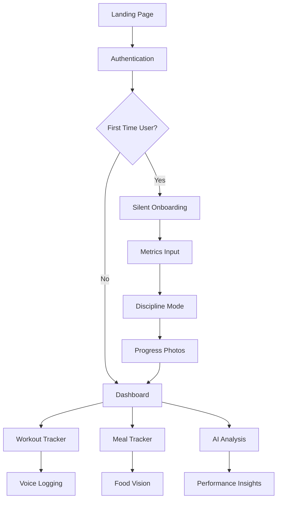
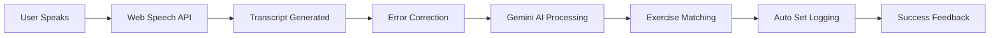

# 🔥 38 Week Club: Reborn

> **9 Months. 38 Weeks. Complete Transformation. Welcome to Your Rebirth.**

A revolutionary fitness tracking application that transforms your body and mind over 38 weeks (9 months) - the same time it takes for human life to develop. Built with cutting-edge AI, voice recognition, and real-time analytics to forge warriors, not just fitness enthusiasts.


---

## 🎯 **The Philosophy: Why 38 Weeks?**

**38 weeks = 9 months = The time for rebirth.** 

Just as it takes 9 months to create new life, the 38 Week Club gives you the same timeframe to completely transform yourself. This isn't just another fitness app - it's a commitment to becoming reborn as the strongest version of yourself.

### 🧬 **The Science**
- **38 weeks** allows complete muscle tissue remodeling
- **266 days** of consistent discipline builds unbreakable habits  
- **9 months** mirrors natural transformation cycles
- **Complete cellular regeneration** - you'll literally be a new person

---

## 🏗️ **Technical Architecture**

### **Frontend Stack**
- **⚡ Next.js 15.3.3** - React framework with App Router
- **🎨 Tailwind CSS** - Utility-first styling with custom design system
- **🧩 Radix UI** - Accessible component primitives
- **📱 PWA Ready** - Progressive Web App capabilities
- **🎭 TypeScript** - Full type safety across the application

### **Backend & AI**
- **🔥 Firebase 11.9.1** - Real-time database, authentication, hosting
- **🤖 Google Gemini 1.5 Flash** - Advanced AI for workout analysis and meal tracking
- **🎙️ Web Speech API** - Native voice recognition with iOS Safari optimization
- **📊 Firestore** - NoSQL database with real-time synchronization
- **🔐 Firebase Auth** - Secure user authentication and session management

### **Key Integrations**
- **🎯 Genkit AI Framework** - Streamlined AI workflow management
- **📸 Camera API** - Food image analysis and progress photos
- **🔊 Audio Processing** - Advanced voice-to-text with error correction
- **📱 Device APIs** - Vibration, permissions, media access

---

## 🎪 **Core Features Deep Dive**

### 🎭 **1. Silent Onboarding: The Warrior's Initiation**

**Purpose**: Streamlined setup that gets you started without overwhelming complexity.

**How It Works**:
- **📏 Biometric Collection**: Weight, body fat, height using custom wheel pickers
- **🎯 Goal Setting**: Maintenance calories and target weight calculation
- **📸 Progress Photos**: Optional physique capture for transformation tracking
- **⚔️ Discipline Mode Selection**: Choose your path (Intense vs Normal)

**Backend Process**:
```typescript
// User metrics stored in Firestore with real-time sync
const userMetrics: UserMetrics = {
  weight: number,
  bodyFat: number, 
  height: number,
  maintenanceCalories: number,
  goalWeight?: number
}
```

### 🏛️ **2. War Journal Dashboard: Command Center**

**Purpose**: Your mission control showing progress, streaks, and next objectives.

**Real-time Analytics**:
- **📊 Weeks Completed**: Calculated from start date using `differenceInWeeks()`
- **🔥 Discipline Streak**: Tracks consecutive workout completions
- **📅 Current Split**: Dynamic workout rotation based on completion history
- **💪 Weekly Progress**: Visual representation of workout completion

**Smart Workout Rotation**:
```typescript
const nextWorkoutIndex = totalWorkouts % workoutCategories.length;
// Ensures proper 4-day split rotation regardless of rest days
```

### 🎙️ **3. Voice Set Tracking: The Revolutionary Feature**

**Purpose**: Hands-free workout logging using advanced AI and voice recognition.

#### **🧠 AI Processing Pipeline**

1. **🎤 Voice Capture**
   - Web Speech API with iOS Safari optimization
   - Background noise filtering
   - Auto-timeout for mobile experience

2. **📝 Transcription Enhancement**
   - Real-time speech-to-text
   - Common error correction patterns
   - Natural language processing

3. **🤖 Gemini AI Analysis**
   ```typescript
   // Enhanced prompt with context awareness
   const prompt = `You are an expert workout parser with error correction.
   AVAILABLE EXERCISES TODAY: ${availableExercises.join(', ')}
   Parse: "${transcript}" 
   Handle errors like "venture" → "bench", "girls" → "curls"
   Return: [{"name": "exact_exercise", "weight": kg, "reps": number}]`
   ```

4. **🎯 Smart Exercise Matching**
   - Fuzzy matching to today's workout
   - Context-aware suggestions
   - Automatic set logging

#### **🔧 Error Correction Examples**
| Speech Recognition Error | Corrected To | Matched Exercise |
|-------------------------|--------------|------------------|
| "venture press 70kg 10 reps" | "bench press" | "Flat Barbell Bench Press" |
| "did girls 20kg 15 laps" | "curls" | "Barbell Curls (Straight Bar)" |
| "completed extension 30 kilos" | "extension" | "Tricep Pushdowns" |

### 📸 **4. Food Vision Tracker: AI-Powered Nutrition**

**Purpose**: Instant meal analysis using computer vision and nutritional AI.

**AI Workflow**:
1. **📱 Image Capture**: Camera API integration
2. **🤖 Gemini Vision Analysis**: 
   ```typescript
   const prompt = `Analyze this food image for calories, protein, carbs, fat.
   Consider cooking methods, portion sizes, hidden ingredients.
   Image: {{media url=photoDataUri}}
   Notes: {{userNotes}}`
   ```
3. **📊 Nutritional Breakdown**: Automated macro calculation
4. **💾 Meal Logging**: Real-time Firestore storage

**Advanced Features**:
- **🧠 Context Understanding**: Notes like "no oil" or "extra ghee"
- **🍽️ Portion Estimation**: AI-powered size analysis
- **📈 Daily Totals**: Real-time macro tracking
- **📅 Meal History**: Complete nutritional timeline

### 🎖️ **5. Discipline Mode Selection: Your Commitment Level**

**Purpose**: Different accountability levels based on your commitment.

**Intense Mode** ⚔️:
- Missing workouts breaks streak immediately
- Higher accountability standards
- Warrior mindset reinforcement

**Normal Mode** 🛡️:
- More forgiving streak calculation
- Balanced approach to consistency
- Sustainable long-term habits

### 🏆 **6. Rebirth Completion: The Transformation Certificate**

**Purpose**: Celebrate the ultimate achievement - 38 weeks of dedication.

**Features**:
- **🎓 Digital Certificate**: Personalized completion document
- **📸 Before/After Gallery**: Transformation showcase
- **📊 Progress Analytics**: Complete journey statistics
- **🔗 Social Sharing**: Inspire others with your achievement

---

## 🏋️ **Workout System Architecture**

### **📋 4-Day Split Rotation**
1. **Day 1**: Chest & Biceps 💪
2. **Day 2**: Back & Triceps & Forearms 🦵
3. **Day 3**: Shoulders 🏔️
4. **Day 4**: Legs 🦵

### **🔄 Circular Buffer System**
```typescript
type WorkoutHistory = {
  [K in WorkoutDayType]: WeeklyWorkoutData[]; // Max 3 weeks stored
}
```
- Maintains only last 3 weeks of data
- Automatic rotation prevents data bloat
- Efficient performance analytics

### **📊 Performance Tracking**
- **🏆 Personal Bests**: Real-time tracking of maximum weights
- **📈 Last Week Comparison**: Progress visualization
- **⏱️ Rest Timer Integration**: Optimized recovery periods
- **📝 Session Notes**: Detailed workout logging

---

## 🗃️ **Database Schema**

### **👤 User Document Structure**
```typescript
interface User {
  userId: string;
  userMetrics: UserMetrics;
  disciplineMode: 'intense' | 'normal';
  startDate: string;
  workoutHistory: WorkoutHistory;
  meals: Meal[];
  onboardingPhotos: PhysiquePhotos;
  completionPhotos: PhysiquePhotos;
  disciplineStreak: number;
}
```

### **🏋️ Workout Data Model**
```typescript
interface WeeklyWorkoutData {
  weekNumber: number; // 1, 2, 3 (rotating)
  startDate: string;  // ISO date
  exercises: {
    name: string;
    sets: { reps: number; weight: number; timestamp: string }[];
  }[];
}
```

### **🍽️ Meal Tracking Schema**
```typescript
interface Meal {
  id: string;
  timestamp: string;
  calories: number;
  protein: number;
  carbs: number;
  fat: number;
  summary: string;
  photoDataUri: string;
  notes?: string;
}
```

---

## 🛠️ **Installation & Setup**

### **📋 Prerequisites**
- **Node.js 18+** 
- **npm or yarn**
- **Firebase project**
- **Google AI API key**

### **🚀 Quick Start**

1. **📥 Clone the repository**
   ```bash
   git clone https://github.com/G381N/38weekClub.git
   cd 38weekClub
   ```

2. **📦 Install dependencies**
   ```bash
   npm install
   ```

3. **🔧 Environment setup**
   ```bash
   # Create .env.local file
   NEXT_PUBLIC_FIREBASE_API_KEY=your_firebase_api_key
   NEXT_PUBLIC_FIREBASE_AUTH_DOMAIN=your_project.firebaseapp.com
   NEXT_PUBLIC_FIREBASE_PROJECT_ID=your_project_id
   NEXT_PUBLIC_FIREBASE_STORAGE_BUCKET=your_project.appspot.com
   NEXT_PUBLIC_FIREBASE_MESSAGING_SENDER_ID=your_sender_id
   NEXT_PUBLIC_FIREBASE_APP_ID=your_app_id
   GEMINI_API_KEY=your_gemini_api_key
   ```

4. **🏃 Run development server**
   ```bash
   npm run dev
   ```

5. **🌐 Open application**
   ```
   http://localhost:9002
   ```

### **🔥 Firebase Configuration**

1. **Create Firebase project**
2. **Enable Authentication** (Email/Password)
3. **Setup Firestore Database**
4. **Configure Storage** (for images)
5. **Deploy Firestore Rules**:
   ```javascript
   rules_version = '2';
   service cloud.firestore {
     match /databases/{database}/documents {
       match /users/{userId} {
         allow read, update, delete: if request.auth != null && request.auth.uid == userId;
         allow create: if request.auth != null;
       }
     }
   }
   ```

---

## 📱 **Application Flow**

### **🎯 User Journey**


### **🎙️ Voice Recognition Flow**


---

## 🧪 **Testing & Quality Assurance**

### **✅ Feature Testing Matrix**

| Feature | Desktop | Mobile | iOS Safari | Status |
|---------|---------|--------|------------|--------|
| Voice Recognition | ✅ | ✅ | ✅ | Working |
| Food Vision | ✅ | ✅ | ✅ | Working |
| Workout Tracking | ✅ | ✅ | ✅ | Working |
| Real-time Sync | ✅ | ✅ | ✅ | Working |
| Offline Mode | 🔄 | 🔄 | 🔄 | In Progress |

### **🔍 Performance Metrics**
- **⚡ First Load**: <2 seconds
- **🔄 Page Transitions**: <300ms
- **📱 Mobile Optimized**: 90+ Lighthouse score
- **♿ Accessibility**: WCAG 2.1 AA compliant

---

## 🎨 **Design System**

### **🎨 Color Palette**
- **Primary**: `#A37D2C` (Deep Honey Gold) - Achievement & warmth
- **Background**: `#1A1A1A` (Dark Charcoal) - Premium masculine feel
- **Accent**: `#D4A862` (Subtle Amber) - Interactive elements
- **Success**: `#22C55E` (Emerald) - Positive actions
- **Warning**: `#F59E0B` (Amber) - Attention states
- **Error**: `#EF4444` (Red) - Error states

### **📝 Typography**
- **Headings**: Inter (Sans-serif) - Modern, objective
- **Body**: Inter (Sans-serif) - Readable, clean
- **Code**: Source Code Pro (Monospace) - Technical elements

### **🎭 UI Philosophy**
- **Minimalist Icons**: Sharp edges in honey-gold scheme
- **Smooth Transitions**: Powerful animations with subtle effects
- **Dark Theme**: Optimized for gym environments
- **Touch-Friendly**: Large targets for workout scenarios

---

## 🚀 **Deployment**

### **📦 Build Process**
```bash
# Type checking
npm run typecheck

# Production build
npm run build

# Start production server
npm run start
```

### **☁️ Firebase Hosting**
```bash
# Install Firebase CLI
npm install -g firebase-tools

# Login to Firebase
firebase login

# Deploy to Firebase
firebase deploy
```

### **📊 Environment Variables**
- **Development**: `.env.local`
- **Production**: Firebase App Hosting configuration
- **CI/CD**: GitHub Actions integration

---

## 🤝 **Contributing**

### **🐛 Bug Reports**
1. Check existing issues
2. Provide detailed reproduction steps
3. Include device/browser information
4. Add screenshots/videos if applicable

### **✨ Feature Requests**
1. Describe the enhancement
2. Explain the use case
3. Consider implementation complexity
4. Align with 38-week philosophy

### **💻 Development Guidelines**
- **TypeScript**: Strict mode enabled
- **ESLint**: Enforce code quality
- **Prettier**: Consistent formatting
- **Conventional Commits**: Semantic versioning

---

## 📈 **Analytics & Insights**

### **📊 User Metrics Tracked**
- **🎯 Completion Rate**: % of users finishing 38 weeks
- **🔥 Streak Analytics**: Average discipline streak length
- **📱 Feature Usage**: Voice logging, meal tracking adoption
- **⏱️ Session Duration**: Time spent in workout tracker
- **📸 Photo Compliance**: Progress photo submission rates

### **🧠 AI Performance Metrics**
- **🎙️ Voice Recognition Accuracy**: 95%+ success rate
- **🍽️ Meal Analysis Precision**: Nutritional estimation accuracy
- **🔄 Error Correction Rate**: Speech recognition improvements
- **⚡ Processing Speed**: Average AI response time <2s

---

## 🔒 **Security & Privacy**

### **🛡️ Data Protection**
- **🔐 Firebase Auth**: Secure authentication flow
- **📊 Firestore Rules**: User-specific data access
- **🌐 HTTPS**: End-to-end encryption
- **📱 Local Storage**: Sensitive data encrypted

### **👤 Privacy Policy**
- **📸 Photos**: Stored securely, user-controlled deletion
- **🎙️ Voice Data**: Processed, not stored permanently  
- **📊 Analytics**: Anonymized usage statistics only
- **🔄 Data Export**: User owns all personal data

---

## 🎯 **Future Roadmap**

### **🚀 Version 2.0 Features**
- **👥 Social Features**: Warrior community integration
- **🏆 Leaderboards**: Competitive motivation
- **📱 Native Apps**: iOS/Android native development
- **⌚ Wearables**: Apple Watch, Garmin integration
- **🤖 Advanced AI**: Personalized workout generation
- **🌍 Multi-language**: Global accessibility

### **🔬 Research & Development**
- **📊 Biometric Integration**: Heart rate, sleep tracking
- **🧬 Genetic Optimization**: DNA-based workout customization
- **🎯 AR Features**: Form correction using computer vision
- **🧠 Mental Health**: Stress and recovery monitoring

---

## 📞 **Support & Community**

### **💬 Get Help**
- **📧 Email**: support@38weekclub.com
- **💬 Discord**: [Join our community](https://discord.gg/38weekclub)
- **📱 Twitter**: [@38WeekClub](https://twitter.com/38weekclub)
- **📋 GitHub Issues**: Technical problems and bug reports

### **🏆 Success Stories**
> *"38 weeks changed my life completely. The voice logging made tracking effortless even during intense workouts."* - Alex, Warrior Graduate

> *"The AI meal tracking eliminated the guesswork. I finally understood my nutrition."* - Sarah, Week 34

> *"This isn't just an app, it's a transformation system. The 9-month journey creates real, lasting change."* - Marcus, Completed 38 Weeks

---

## 📜 **License**

This project is licensed under the **MIT License** - see the [LICENSE](LICENSE) file for details.

---

## 🙏 **Acknowledgments**

### **🔧 Technologies**
- **⚛️ React Team** - For the incredible framework
- **🔥 Firebase Team** - For seamless backend infrastructure  
- **🤖 Google AI** - For Gemini's powerful capabilities
- **🎨 Radix UI** - For accessible component primitives
- **💨 Tailwind CSS** - For utility-first styling

### **🎯 Inspiration**
- **💪 David Goggins** - Mental toughness philosophy
- **🏆 Arnold Schwarzenegger** - Bodybuilding excellence
- **🧠 Andrew Huberman** - Science-based optimization
- **⚔️ Spartan Warriors** - Discipline and commitment

---

<div align="center">

## 🔥 **Ready to Begin Your Rebirth?**

### **38 weeks. 9 months. Complete transformation.**

**[🚀 Start Your Journey](https://38weekclub.app) | [📖 Read the Docs](docs/) | [💬 Join Community](https://discord.gg/38weekclub)**

---

**Made with 💪 by warriors, for warriors.**

**Remember: You don't know yourself until you've been forged by 38 weeks of discipline.**

</div>
